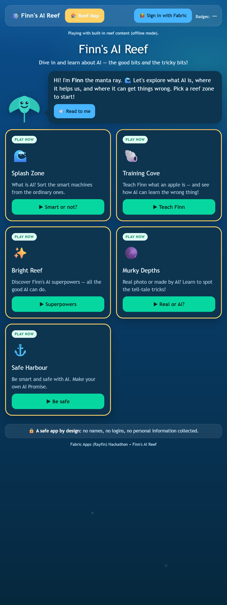
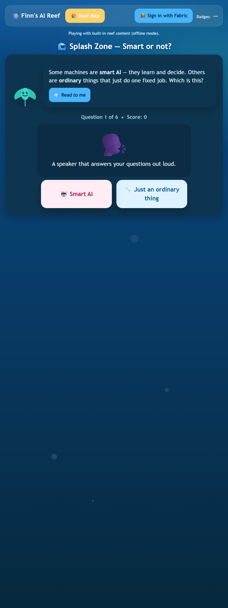
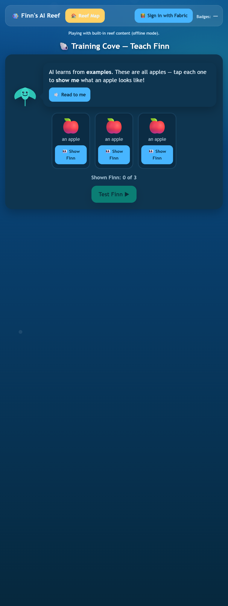
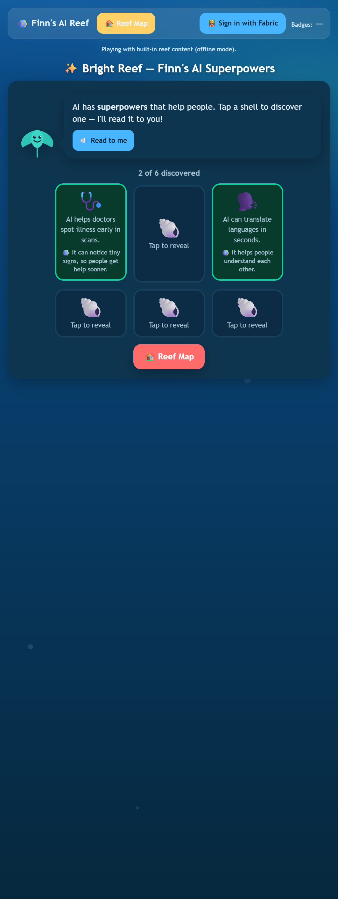
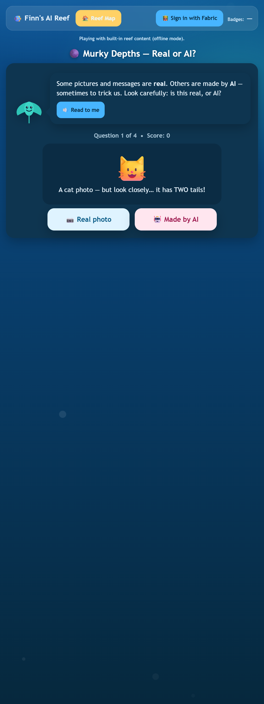
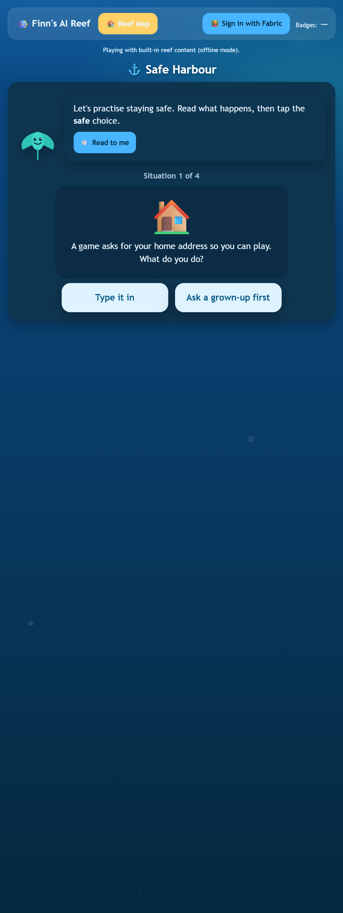

# 🐠 Finn's AI Reef

> A safe, playful web app that teaches UK primary‑school children (Reception → Year 6) what AI is — the good bits **and** the tricky bits — guided by **Finn**, a friendly robot manta ray.

[](https://easy-horn-9c000b3199-swedencentral.webapp.fabricapps.net)


**▶ Try it live:** https://easy-horn-9c000b3199-swedencentral.webapp.fabricapps.net
&nbsp;•&nbsp; Built for the **Fabric Apps (Rayfin) Hackathon**.



> ### 👩‍⚖️ For judges — start here
> - **Try it (no setup):** open the [live app](https://easy-horn-9c000b3199-swedencentral.webapp.fabricapps.net) → tap any reef zone → play. Every zone works without signing in.
> - **The idea in one line:** teach 4–11‑year‑olds AI literacy through play, with zero child data collected.
> - **What makes it stand out:** [🔒 Safe by design](#-safe-by-design-the-differentiator) — safeguarding is enforced in the data model, not just promised.
> - **Review the code fast:** [repo map](#review-the-code--repo-map) · [data model + safeguarding](fin-ai-reef/rayfin/data/models.ts) · [a game screen](fin-ai-reef/src/screens/teach-finn.tsx)

## Contents

- [The problem](#the-problem)
- [Who it's for](#who-its-for)
- [The experience — five reef zones](#the-experience--five-reef-zones)
- [🔒 Safe by design (the differentiator)](#-safe-by-design-the-differentiator)
- [Try it](#try-it)
- [How it's built](#how-its-built)
- [Deploy](#deploy)
- [Roadmap](#roadmap)

---

## The problem

AI is now part of children's daily lives — in games, search, voice assistants, photos and homework help. But most primary‑age children:

- **Don't know what AI actually is** (or that a talking speaker is different from a light switch),
- **Can't tell real from AI‑generated** images and messages, which makes them easy to mislead, and
- **Aren't taught how to stay safe** around tools that ask for personal information.

Meanwhile, most "kids + data" apps create a safeguarding headache: they collect names, logins, and free‑text — exactly the things a school **can't** risk with young children.

**Finn's AI Reef** teaches AI literacy through play, and is **safe by design**: children never log in, never type free text, and no personal information is ever collected.

## Who it's for

- **Children (Reception–Year 6)** — the players. Tap‑only, read‑aloud, big friendly targets, no reading barrier.
- **Teachers** — the only people who sign in (via Fabric SSO). They own their class content and see anonymous progress analytics.

---

## The experience — five reef zones

Each zone is a short, tap‑based mini‑game. Finn introduces it, reads everything aloud (“🔊 Read to me”), and gives friendly feedback. Completing a zone earns a **badge** 🐚.

### 🌊 Splash Zone — *What is AI?*
Sort the **smart machines** (that learn and decide) from **ordinary things** (that do one fixed job). Builds the core concept: not every gadget is “AI”.



### 🐚 Training Cove — *How AI learns (and gets it wrong)*
Children **teach Finn** what an apple is by showing examples — then watch how AI can learn the *wrong* thing when the examples are biased. A hands‑on intro to training data and bias.



### ✨ Bright Reef — *AI's superpowers*
Tap shells to discover the **good** AI can do — spotting illness in scans, reading the world aloud for people who can't see, translating languages. Balances the “tricky bits” with real benefits.



### 🌑 Murky Depths — *Real or AI?*
Look closely: is this a **real photo** or **made by AI**? Children learn the tell‑tale tricks (a cat with two tails!) that expose AI fakes.



### ⚓ Safe Harbour — *Staying safe with AI*
Practise safe choices in everyday situations (“a game asks for your home address…”), then build a personal **AI Promise** — by tapping ready‑made pledges, never by typing.



---

## 🔒 Safe by design (the differentiator)

Safeguarding isn't a setting — it's baked into the architecture and the data model.

| Principle | How it's enforced |
| --- | --- |
| **Children never authenticate** | Only educators sign in (Fabric SSO). The child experience needs no account. |
| **No child PII, ever** | Pupils are pseudonymous — an emoji avatar + auto nickname (e.g. `Blue‑Turtle‑7`). |
| **No free text from children** | Every answer is a tap. The AI Promise is built from pre‑written choices. |
| **Anonymous analytics only** | `AttemptEvent` records *what* happened (answer, correct/incorrect), never *who*. |
| **Row‑level ownership** | A teacher can only ever read/write their **own** class records (enforced in the data model). |
| **Content is curated** | Questions come from a teacher‑governed table, not from a live model. |

These rules are encoded directly in [fin-ai-reef/rayfin/data/models.ts](fin-ai-reef/rayfin/data/models.ts) — see the role policies below.

---

## Try it

### Option A — just play (no setup)
Open the live app: **https://easy-horn-9c000b3199-swedencentral.webapp.fabricapps.net**
It runs on built‑in reef content (offline mode), so every zone is playable without signing in.

### Option B — run locally

```powershell
cd fin-ai-reef
npm install
npm run dev
```

Then open **http://localhost:5173**. The app ships with a bundled content seed, so all five zones work immediately with no backend.

> Prerequisites: Node.js 20+ and access to the Rayfin/Fabric npm registry (the packages are `@microsoft/rayfin-*`).

---

## How it's built

**Finn's AI Reef is a Fabric App** built on the **Rayfin** framework (React + Vite front end, Fabric‑hosted static site + data service).

- **Front end:** React 19 + Vite + TypeScript, custom ocean theme (no heavy UI kit).
- **Auth:** `@microsoft/rayfin-auth-provider-fabric` — Fabric SSO for **educators only**.
- **Data:** Rayfin data service (MSSQL dialect) with entities declared via decorators.
- **Accessibility:** read‑aloud via the Web Speech API, ≥44px tap targets, focus rings, `prefers-reduced-motion` support.
- **Offline‑first content:** a bundled seed means the app is always playable; it only queries the live tables when an educator is authenticated.

### Review the code — repo map

```
RayFinAIReef/
├─ README.md                      ← you are here
├─ docs/screenshots/              ← images used in this README
└─ fin-ai-reef/                   ← the app
   ├─ src/
   │  ├─ App.tsx                  ← screen router + top bar + badges
   │  ├─ screens/                 ← one file per zone (the games)
   │  │  ├─ reef-map.tsx          ·  home / zone picker
   │  │  ├─ smart-or-not.tsx      ·  🌊 Splash Zone
   │  │  ├─ teach-finn.tsx        ·  🐚 Training Cove
   │  │  ├─ superpowers.tsx       ·  ✨ Bright Reef
   │  │  ├─ real-or-ai.tsx        ·  🌑 Murky Depths
   │  │  └─ safe-harbour.tsx      ·  ⚓ Safe Harbour
   │  ├─ components/finn.tsx       ← Finn mascot + speech bubble
   │  ├─ hooks/use-class-mode.tsx  ← educator sign‑in + pupil session
   │  ├─ lib/reef-content.ts       ← content loader (bundled seed ↔ live tables)
   │  ├─ data/reef-content.ts      ← bundled seed content (zones, questions, badges)
   │  └─ reef.css                  ← ocean theme
   ├─ rayfin/
   │  ├─ data/models.ts            ← data model + safeguarding role policies
   │  └─ rayfin.yml                ← auth, data & hosting config
   └─ seed/reef-content.seed.json  ← seed for the deployed database
```

Fast paths for reviewers:

- **See the safeguarding rules:** [fin-ai-reef/rayfin/data/models.ts](fin-ai-reef/rayfin/data/models.ts)
- **See a game:** [fin-ai-reef/src/screens/teach-finn.tsx](fin-ai-reef/src/screens/teach-finn.tsx)
- **See the content model:** [fin-ai-reef/src/data/reef-content.ts](fin-ai-reef/src/data/reef-content.ts)

### The data model, in one glance

Six entities in [fin-ai-reef/rayfin/data/models.ts](fin-ai-reef/rayfin/data/models.ts):

| Entity | Purpose | Access |
| --- | --- | --- |
| `Zone`, `Question`, `Badge` | Curated learning content | **Read:** any signed‑in user · **Write:** `teacher`/`admin` only |
| `Classroom`, `PupilSession` | A class + pseudonymous pupils (no PII) | Owner‑only (`claims.sub == teacherId`) |
| `AttemptEvent` | Anonymous “what happened” analytics | Owner‑only, create + read |

Content writes are gated by a role policy:

```ts
@role("authenticated", "read")
@role("authenticated", ["create", "update", "delete"], {
    policy: (claims) => claims.role.eq("teacher").or(claims.role.eq("admin")),
})
export class Question { /* … */ }
```

Owner‑scoped rows are gated per record:

```ts
@role("authenticated", "*", {
    policy: (claims, item) => claims.sub.eq(item.teacherId),
})
export class Classroom { /* … */ }
```

---

## Deploy

From `fin-ai-reef/`, the Rayfin CLI provisions the data service, applies the schema, and publishes the static site:

```powershell
cd fin-ai-reef
& '.\node_modules\.bin\rayfin.cmd' up
```

This deploys to the Fabric workspace configured in [fin-ai-reef/rayfin/rayfin.yml](fin-ai-reef/rayfin/rayfin.yml) (auth allowed‑redirect URIs, data dialect, and static hosting).

---

## Roadmap

- **Teacher dashboard:** class creation, join codes, and anonymous zone‑by‑zone progress.
- **Per‑user teacher/admin roles:** map Entra app roles/groups into the `role` claim for true admin vs. teacher separation.
- **More zones & Key‑Stage tagging:** content already carries a `keyStage` field for age‑appropriate filtering.
- **Seed the live database** so signed‑in classes read curated content from Fabric instead of the bundled seed.

---

<sub>Finn's AI Reef • Fabric Apps (Rayfin) Hackathon. A safe app by design: no names, no logins, no personal information collected.</sub>